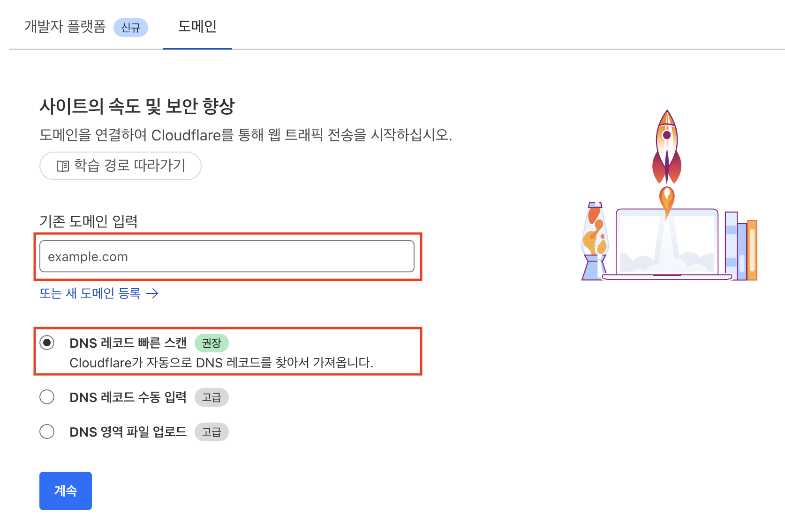

## 개요

- CloudFlare Pages를 사용하여 Next js 정적 페이지 배포를 하고 가비아에서 구입한 도메인을 이용하여 도메인 연결
- CloudFlare Rules, Bulk Redirets 를 사용하여 리디렉션 규칙 설정

## CloudFlare Pages를 사용한 정적 페이지 배포

- CloudFlare Pages의 배포는 직접 업로드 방식과 원격 Git 저장소와 연결하여 배포하는 방식이 있다. 여기서는 Git 저장소와 연결하여 배포를 할 것이다.
- CloudFlare 메뉴의 컴퓨팅(Works) -> 생성 -> Pages -> Git에 연결 클릭
- 배포하고자 하는 깃 레포 연결 후 선택

- 필요한 정보 입력
- 프레임 워크 미리 설정 : 나의 경우에는 Next.js의 Static Export 기능을 사용했기에 해당 기능을 선택하였다.

- 기다리면 배포가 완료가 될 것이다. 안된다면 로그를 확인하여 해결해보자.
- 배포가 완료되면 CloudFlare에서 제공하는 자체 도메인으로 페이지 접속이 가능할 것이다. 

## CloudFlare 도메인 연결

- 가비아에서 구매한 도메인과 CloudFlare와 연결할것이다.
- CloudFlare에서 제공하는 다양한 기능(DDOS 방어, WAF, CDN, SSL 등) 을 위해서는 CloudFlare의 네임서버를 사용하여야만 한다. 나아가 가비아에서 CloudFlare로 도메인을 이전하는것이 도메인 등록 및 갱신 비용을 절감할 수 도 있기는 하나 이전할 때 비용이 발생 할 수도 있기에 여기서는 일단 연결만 한다.
- 작업하기 전에 가비아에 레코드가 등록되어 있다면 모두 삭제하자. 앞으로 도메인관리를 CloudFlare에서 하는것이 편하기 때문이가.
- 다음과 같이 이동한다. 메뉴의 계정 홈 -> 도메인
- 연결하고자 하는 도메인 입력
- DNS 레코드 빠른 스캔

- 가비아에서 등록한 레코드가 없기에 레코드를 찾지 못하고 끝날 것이다.
- 활성화로 계속 클릭

- 가비아로 이동하여 기존에 있던 네임서버를 삭제하고 CloudFlare에서 제공하는 네임서버를 추가한다.
- 가비아 접속 -> my 가비아 -> 도메인 -> 관리 -> 네임서버 설정 클릭
- 아래와 같이 CloudFlare의 네임서버로 변경한다.

- 메뉴의 계정 홈 -> 도메인 이동
- 시간이 20~30분 정도 지나면 아래와 같이 활성 상태로 변경될 것이다.

- Pages로 이동하여 배포로 이동

- 사용자 설정 도메인으로 이동
- 사용자 설정 도메인 설정 클릭, 나의 경우에는 등록한 도메인이 있어서 화면이 조금 다를 수 있다.
- 연결하고자 하는 도메인을 입력하여 과정을 진행한다.
	- `example.com`, `www.example.com` 을 입력하는걸 추천
- 활성되는데 까지 시간이 조금 걸린다.

- 활성이 된 것을 확인하고 도메인으로 접속해보면 될 것이다.

- 그러면 현재 `example.com` , `www.example.com` , `*.pages.dev`  이 셋 모두로 접속이 되고 url에 표시가 될텐데 이러면 SEO, UX 관점에서 좋지 않다. 따라서 하나의 도메인으로만 리다이렉트 될 수 있도록 설정하는 것이 좋다.
	- `*.pages.dev` 는 검색엔진에 노출이 안되긴 하는데 통일을 위해서...
- 이를 위해서는 규칙([Page Rules](https://developers.cloudflare.com/rules/page-rules/)), 대량 리디렉션([Bulk Redirects](https://developers.cloudflare.com/rules/url-forwarding/bulk-redirects/))을 사용하면 된다.
- 메뉴의 계정 홈 -> 도메인 이동 후 아래와 같이 과정을 진행한다.

- 아래 화면은 조금 다를 수 있다. 나의 경우에는 이미 규칙을 생성했기 때문이다.

- 배포 후 시간이 10초 정도 지난 후 www로 시작하는 도메인으로 접속해보면 루트 도메인으로 리디렉션을 확인 할 수 있다.
- 이제 `*.pages.dev` -> 루트 도메인으로 리디렉션 설정 해보자.
- 클라우드 플레어 메인 홈페이지로 이동 -> 대량 리디렉션 클릭 -> 아래와 같이 진행한다.

- 대상 URL에는 리디렉션 하고자하는 루트 도메인 입력
- 매개변수 모두 체크한다. 그래야 `*.pages.dev/*` 의 뒤의 * 값에 대해서도 유지가 된 상태로 리디렉션된다.

- 이제 url에 `*.pages.dev/*` 로 입력해도 루트 도메인으로 이동하는 것을 확인 할 수 있을 것이다.
	- 만약 뒤의 * 값이 제대로 리디렉션 되지 않는다면 나중에 확인을 해보자. 나의 경우에는 다음 날 확인해보니 제대로 리디렉션 되었다.
